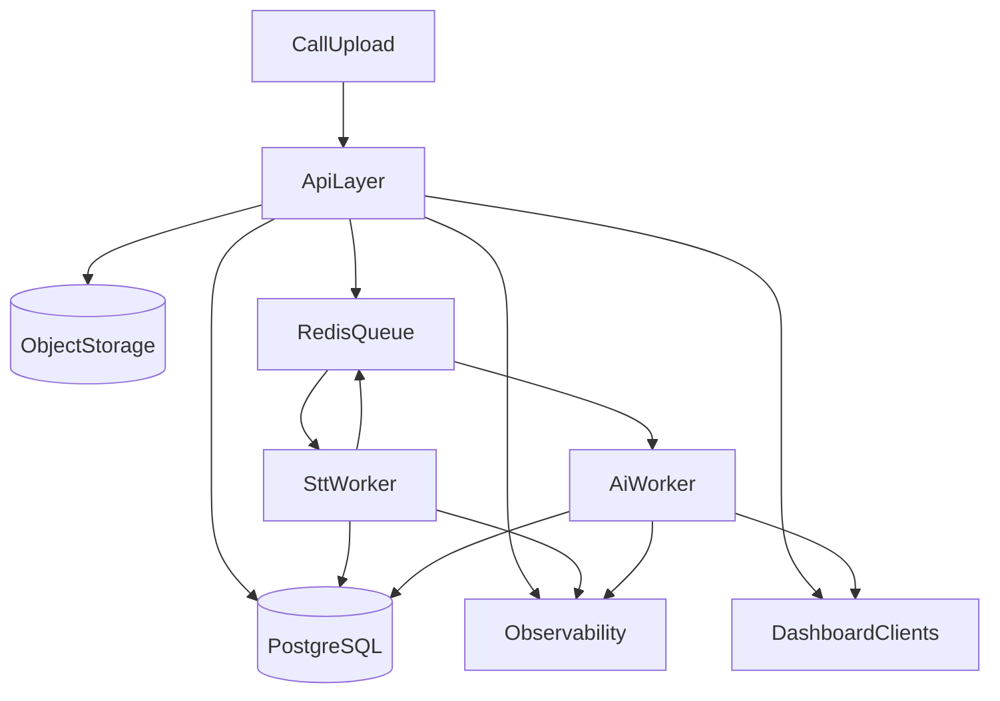

# CollectIQ — Product Strategy & Value Proposition

---

## 🎯 The Problem We Solve

Every day, thousands of collection calls happen across banks and NBFCs. What happens on those calls? **Nobody really knows.**

Today's reality:

- **QA teams listen to only 2–5% of calls** — the rest go unreviewed
- **Borrower promises are tracked on spreadsheets** — no one remembers what was said last week
- **Compliance violations go undetected** — until a regulator or ombudsman complaint lands
- **Recovery agents prioritize by gut feel** — not by who is most likely to pay
- **Borrowers change their story across calls** — and nobody catches the inconsistency

The result? **Lower recovery rates, compliance risk, and wasted agent effort.**

---

## 💡 What CollectIQ Does

CollectIQ listens to every single collection call and turns it into **structured, actionable intelligence** — automatically.

> Think of it as a **senior analyst sitting on every call**, taking notes, scoring the borrower, flagging risks, and briefing the team — but at the scale of thousands of calls per day.

---

## 🏗 How It Works — The Simple Flow

```
┌──────────────────────────────────────────────────────────────┐
│                     THE COLLECTIQ FLOW                       │
│                                                              │
│   📞 Collection Call Happens                                 │
│         ↓                                                    │
│   🎙 Call Recording is Uploaded                              │
│         ↓                                                    │
│   📝 AI Converts Speech to Text                             │
│      (identifies who said what — agent vs borrower)          │
│         ↓                                                    │
│   🧠 AI Analyzes the Conversation                           │
│      ┌──────────────────────────────────────┐               │
│      │  • Is the borrower willing to pay?   │               │
│      │  • Did they promise a specific       │               │
│      │    amount and date?                  │               │
│      │  • Did the agent follow rules?       │               │
│      │  • Are they saying something         │               │
│      │    different from last time?         │               │
│      │  • What should we do next?           │               │
│      └──────────────────────────────────────┘               │
│         ↓                                                    │
│   📊 Results Appear on the Dashboard                        │
│      (scores, alerts, trends, recommendations)               │
│                                                              │
│   👥 Teams Act on the Intelligence                          │
│      • Recovery team follows up the right people             │
│      • Compliance team reviews flagged calls                 │
│      • Managers track performance over time                  │
└──────────────────────────────────────────────────────────────┘
```

---

## 🔍 The Five Intelligence Layers

### 1. 🎯 Repayment Intent Scoring

**What it does:** Gives every borrower a "willingness to pay" score from 0 to 100 after each call.

**Why it matters:**

- A borrower who says _"I'll try to pay something next month"_ scores very differently from one who says _"I already transferred the full amount, here's the reference number"_
- Teams stop guessing and start **prioritizing based on real signals**
- Agents who consistently extract higher intent can be identified and their techniques replicated

**Example Output:**
| Borrower | Intent Score | Signal |
|---|---|---|
| Priya Sharma | 95/100 | Already paid, provided UTR number |
| Rajesh Kumar | 62/100 | Willing but conditional — claims job loss |
| Amit Patel | 15/100 | Hostile, refuses to pay, cites court case |
| Mohammed Irfan | 25/100 | Evasive, vague promises, avoids calls |

---

### 2. 💰 Promise-to-Pay Tracking

**What it does:** Automatically captures every payment commitment — amount, date, and how confident we should be about it.

**Why it matters:**

- No more relying on agent notes that say _"customer promised to pay"_
- Each promise gets a **confidence score** — a firm _"I'll pay ₹45,000 by Friday via NEFT"_ is treated very differently from a vague _"I'll try maybe next month"_
- **Broken promises are flagged** — if a borrower commits on Monday and doesn't pay by Friday, the system knows

**Example Output:**
| Borrower | Promised Amount | Promised Date | Confidence |
|---|---|---|---|
| Priya Sharma | ₹45,000 | Feb 10 | 95% — Already transferred |
| Rajesh Kumar | ₹20,000 | Jan 31 | 70% — Verbal, conditional |
| Sunita Devi | ₹5,000/month | Ongoing | 75% — Under hardship plan |
| Mohammed Irfan | ₹30,000 | Feb 28 | 25% — Vague, evasive history |

---

### 3. 🛡 Compliance Monitoring

**What it does:** Automatically detects when a collection agent crosses the line — threats, harassment, intimidation, or improper language.

**Why it matters:**

- **Every single call is monitored**, not just the 2% that QA samples
- Violations are flagged with **severity levels** (low / medium / high) and **exact evidence quotes**
- Catches issues _before_ they become ombudsman complaints or legal cases
- Protects the bank's reputation and agent accountability

**What gets flagged:**

- ❌ _"Your family will come to know about this. Think about your reputation."_ → **Intimidation (High)**
- ❌ _"We will send people to your house and shop"_ → **Threatening language (High)**
- ✅ _"If there is no payment, the account may be referred for recovery proceedings"_ → **Acceptable escalation warning (Not flagged)**

---

### 4. 🔄 Cross-Call Consistency Engine

**What it does:** Compares what a borrower says across multiple calls and flags contradictions.

**Why it matters:**
This is the feature no one else has. Borrowers talk to different agents on different days. They may:

- Claim job loss in one call, then mention freelance income of ₹35,000/week in the next
- Say their spouse is not working, then later mention spouse's salary
- Promise ₹60,000/month, then reduce it to ₹15,000 without explanation
- Cite a "court case" in January that becomes an "out-of-court settlement" in February

**Real example from the platform:**

| Call 1 (Jan 10)                   | Call 3 (Feb 18)                               | Flag                       |
| --------------------------------- | --------------------------------------------- | -------------------------- |
| _"I lost my job, have no income"_ | _"I earned ₹35,000 freelancing last week"_    | 🚩 Income inconsistency    |
| _"Job offer, joining Feb 15"_     | _"Joining delayed, background check pending"_ | 🚩 Employment status shift |
| _"I'll pay ₹60,000/month"_        | _"I can only pay ₹15,000 this week"_          | 🚩 Decreasing commitments  |

**This turns a single call into a chapter in a broader story.** Managers see the full picture, not isolated snapshots.

---

### 5. 📋 Auto-Generated Call Summaries

**What it does:** Every call gets an instant, structured summary — no more listening to recordings or reading agent notes.

**Includes:**

- **What happened** — 2-3 sentence synopsis
- **Key points** — bullet-point highlights
- **Next actions** — what the team should do next
- **Risk flags** — warning signs to watch
- **Outcome category** — committed / partial / refused / dispute / escalation

**Before CollectIQ:**

> Agent note: _"Spoke to customer. Will pay later."_

**After CollectIQ:**

> _"Borrower claims job loss from TechServ Solutions 2 months ago. Wife employed but savings limited. Promises ₹20,000 by Jan 31 from savings. Requests EMI restructuring upon re-employment. Cooperative tone. **Next:** Follow up Jan 31, flag for hardship review, verify employment status."_

---

## 📊 The Dashboard Experience

### For the Collections Manager

- **At a glance:** Total calls, average intent score, compliance flags, active promises
- **Outcome breakdown:** How many calls resulted in commitments vs refusals
- **Risk distribution:** Which customers are low, medium, high, or critical risk
- **Recent calls:** Quick-access table with intent scores and outcomes

### For the Recovery Team

- **Prioritized call list:** Sorted by who is most likely to pay (or most overdue)
- **Call detail view:** Full transcript with AI analysis — no need to re-listen
- **Promise tracker:** See all active commitments and which ones were honored

### For the Compliance Team

- **Violation dashboard:** All flagged calls in one place
- **Severity filtering:** Focus on high-severity issues first
- **Agent accountability:** See which agents have compliance issues

### For Risk Teams

- **Customer timeline:** Every call with a borrower on one chronological view
- **Intent trends:** Is this borrower becoming more or less cooperative over time?
- **Risk trajectory:** Is the situation improving or deteriorating?
- **Inconsistency alerts:** Where the borrower's story doesn't add up

---

## 💎 Value Proposition

### For the Bank / NBFC

| Metric                  | Impact                                           |
| ----------------------- | ------------------------------------------------ |
| **QA Coverage**         | From 2-5% sampled → **100% of calls analyzed**   |
| **Manual QA Time**      | **40% reduction** — AI does the first pass       |
| **Follow-up Targeting** | **15% improvement** — prioritize by intent score |
| **Compliance Risk**     | **Near-zero blind spots** — every call monitored |
| **Agent Productivity**  | Less documentation, more calling time            |
| **Recovery Rates**      | Better targeting = more payments collected       |

### For Collection Agents

- **No more manual call notes** — summaries are auto-generated
- **Better preparation** — they see what was said in previous calls before dialing
- **Fair evaluation** — performance measured on data, not random QA samples

### For Borrowers (Indirectly)

- **More consistent experience** — agents know their history
- **Less harassment** — compliance monitoring creates accountability
- **Better resolution options** — hardship cases get properly flagged and routed

---

## 🏆 Competitive Advantage

| Feature             | Traditional QA  | Generic Speech Analytics | CollectIQ                |
| ------------------- | --------------- | ------------------------ | ------------------------ |
| Coverage            | 2-5% of calls   | All calls                | All calls                |
| Intent Scoring      | ❌              | Basic sentiment          | ✅ Collection-specific   |
| Promise-to-Pay      | Manual tracking | ❌                       | ✅ Auto-extracted        |
| Cross-Call Analysis | ❌              | ❌                       | ✅ **Unique capability** |
| Compliance          | Random audits   | Keyword-based            | ✅ Context-aware AI      |
| Domain Focus        | Generic         | Generic                  | ✅ Built for collections |
| Time to Insight     | Days            | Hours                    | **Real-time**            |

### What Makes Us Different

1. **Built specifically for loan collections** — not a generic call analytics tool repurposed
2. **Cross-call memory** — the only platform that connects borrower behavior across multiple interactions
3. **Confidence-scored promises** — not just "did they promise?" but "should we believe them?"
4. **Context-aware compliance** — understands the difference between a factual warning and an actual threat
5. **Actionable intelligence** — every analysis comes with recommended next steps

## 📈 Success Metrics

### Platform Success

- Number of calls analyzed per month
- Average time to generate insights (target: < 2 minutes)
- User engagement with dashboard (daily active users)

### Customer Success

- % reduction in manual QA hours
- Improvement in promise-to-pay fulfillment rate
- Number of compliance violations caught early
- Recovery rate improvement in prioritized accounts

### Business Success

- Monthly recurring revenue (MRR)
- Customer retention rate
- Net Promoter Score from collection managers

---

## Production-Grade Architecture Blueprint (Single-Tenant)

This section converts the product vision into an implementation-ready architecture for a production rollout where one bank or NBFC runs one isolated CollectIQ deployment.

### 1) Target Operating Model

- **Single tenant, isolated stack:** one deployment per customer account (API, workers, database, storage)
- **Stateless API tier:** request handling only; heavy work is pushed to background jobs
- **Asynchronous intelligence pipeline:** transcription and AI analysis run via queue-driven workers
- **Traceable decisions:** every score/flag stores evidence and model metadata for auditability
- **Operational safety first:** retries, idempotency, observability, and strict security baseline

### 2) End-to-End Processing Flow (Sync vs Async)

**Synchronous path (user-facing):**

1. Agent uploads call audio and metadata.
2. API validates request and persists a `call` record with `status=queued`.
3. Audio file is saved to object storage and a job is pushed to queue.
4. API returns immediately with a `callId` for dashboard tracking.

**Asynchronous path (background):**

1. STT worker consumes `transcribe_call` job and writes transcript segments.
2. Analysis worker consumes `analyze_call` job and runs intent/compliance/PTP/cross-call/summary chains.
3. Worker writes `analysis_result`, updates call status, and emits event for UI refresh.
4. Failures are retried with backoff; permanent failures move to dead-letter queue with reason.



### 3) Layer Responsibilities

| Layer | Responsibilities | Notes |
| --- | --- | --- |
| API Layer | Auth, validation, request handling, pagination/filtering, job creation | Never runs long AI workloads inline |
| Processing Layer | STT + AI jobs, retry policy, idempotent updates, event emission | Horizontal scale by worker count |
| Data Layer | PostgreSQL transactional data, Redis queue/cache, object storage for audio | No local disk dependency in prod |
| Observability Layer | Structured logs, metrics, traces, health endpoints | Required for incident response and SLA |

### 4) Codebase Structuring Blueprint

**Target backend structure:**

```text
backend/
  src/
    api/
      routes/
      controllers/
      validators/
      middlewares/
    domain/
      entities/
      repositories/
      useCases/
    application/
      services/
      orchestration/
      dto/
    infrastructure/
      database/
      queue/
      storage/
      ai/
      clients/
    workers/
      sttWorker.js
      analysisWorker.js
    shared/
      config/
      logger/
      errors/
      telemetry/
      utils/
    app.js
    server.js
```

**Target frontend structure:**

```text
frontend/
  src/
    app/
    pages/
    components/
    services/
    stores/
    utils/
  public/
```

**Mapping current MVP modules to target structure:**

| Current module | Target module |
| --- | --- |
| `backend/routes/calls.js` | `backend/src/api/routes/calls.routes.js` + `backend/src/api/controllers/calls.controller.js` |
| `backend/routes/customers.js` | `backend/src/api/routes/customers.routes.js` + `backend/src/api/controllers/customers.controller.js` |
| `backend/ai/pipeline.js` | `backend/src/application/orchestration/analyzeCall.workflow.js` |
| `backend/ai/chains/*.js` | `backend/src/infrastructure/ai/chains/*.js` |
| `backend/db/setup.js` | `backend/src/infrastructure/database/sequelize/index.js` |
| `backend/db/models/*.js` | `backend/src/domain/entities/*` + ORM mappings in `infrastructure/database` |
| `backend/services/openRouterClient.js` | `backend/src/infrastructure/clients/openRouter.client.js` |
| `backend/services/sttService.js` | `backend/src/infrastructure/clients/deepgram.client.js` + `workers/sttWorker.js` |
| `frontend/js/*.js` | `frontend/src/pages/*`, `frontend/src/components/*`, `frontend/src/services/apiClient.js` |

### 5) Production Baseline Controls

**Security and access:**

- JWT-based authentication with role-based authorization (`manager`, `agent`, `compliance`, `risk`)
- Request validation at API boundary for all params/body payloads
- Strict CORS allowlist per environment
- Rate limiting and IP throttling on upload and analysis endpoints
- Encryption in transit (TLS) and encryption at rest for database and object storage

**Reliability and correctness:**

- Idempotency keys for upload/analyze triggers
- Queue retry policy with exponential backoff and dead-letter queue
- Timeout budgets for STT and LLM providers
- Circuit breaker or fallback policy when external providers degrade
- Versioned API (`/api/v1`) and backward-compatible response contracts

**Observability and operations:**

- Structured JSON logs with request/job correlation IDs
- Metrics for queue depth, analysis latency, STT latency, provider error rates, and failed jobs
- Tracing across API -> queue -> worker execution
- Health endpoints (`/health/live`, `/health/ready`) and dependency checks
- Audit log for compliance flags and manual overrides

### 6) Data and Deployment Topology

- **PostgreSQL:** source of truth for customers, calls, transcripts, analysis results
- **Redis:** queue + short-lived cache for dashboard and worker coordination
- **Object storage (S3 compatible):** call audio and optional transcript artifacts
- **Containerized services:** `api`, `stt-worker`, `analysis-worker`, `scheduler`
- **Environment isolation:** separate `dev`, `staging`, `prod` with isolated infra and secrets
- **Secrets management:** runtime secrets from secret manager; no plaintext secrets in repo

### 7) Phased Migration Roadmap (No Big-Bang Rewrite)

**Phase 0 - Foundations (1 sprint)**

- Introduce `backend/src` structure and move entrypoints behind `app.js` composition
- Add centralized config, logger, error model, and request validation middleware
- Keep existing API behavior unchanged

**Phase 1 - Data platform hardening (1-2 sprints)**

- Migrate SQLite schema to PostgreSQL with migration scripts
- Replace `sequelize.sync({ alter: true })` with controlled migrations
- Add indexes for frequent dashboard and timeline queries

**Phase 2 - Async processing (1 sprint)**

- Introduce Redis queue and split STT/AI into workers
- Convert analyze endpoint to enqueue workflow and return job/call status
- Add retry and dead-letter handling

**Phase 3 - Security and governance (1 sprint)**

- Implement authn/authz and tenant-scoped roles for single customer org
- Enforce rate limiting, CORS allowlist, and audit logging
- Add PII handling policy for transcript and audio retention

**Phase 4 - Observability and release readiness (1 sprint)**

- Add metrics, tracing, SLO dashboards, and alerting
- Add health/readiness checks for orchestrated deployment
- Define backup, restore, and disaster recovery runbooks

**Phase 5 - Quality gates and rollout (1 sprint)**

- Add unit/integration tests for API, pipeline, and worker flows
- Add smoke tests for upload -> analysis -> dashboard lifecycle
- Roll out to staging, run shadow traffic, then production cutover

---

## 🎯 Summary

**CollectIQ is not a call recording tool. It's a decision-making engine for collections teams.**

It answers the questions that matter:

- _Who should we call first today?_
- _Is this borrower getting more or less cooperative?_
- _Are our agents following the rules?_
- _Is this borrower telling us the truth?_
- _What happened on the last 5 calls with this person?_

**Every collection call becomes a data point. Every data point becomes an insight. Every insight becomes a better recovery outcome.**
